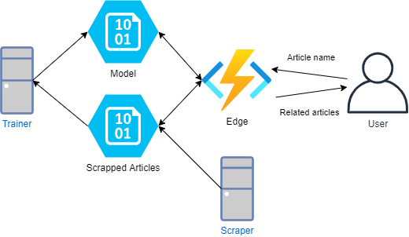

# Simgine

Simgine: Serverless real-time document similarity engine using Python and Azure Functions

## Functionalities

For an end user:
  - Given an article name system will return a response with articles 
  which are semantically similar to it, with included mutual categories as used by Wikipedia's internal system

Other functionalities not available to the end user:
  - scraping web pages, extracting all of the relevant contents
  - downloading scraped articles from azure blob storage
  - saving model to az blob storage

## Architecture

training and scraping initially were to performed inside Az functions function. However we concluded that it will add unnecessary complexity with diminishing returns. It was possible that Wikipedia could rate limit the scraper, scraper could produce much more data than we could handle. In case of trainer, it was a long running process, it was certain that a timeouts would occurs which would have caused problems along the way.

## Technology Stack

- Azure Ecosystem:
    - Blob Storage
    - Functions
- Python 3.9 
    - requests
    - PyYAML
    - gensim
    - azure-functions
    - azure-storage-blob

## Wikipedia
Wikipedia's robots.txt doesn't disallow scraping of article pages

## Contributors

- Piotr Jeleniewicz -> azure deployment
- Aleksei Haidukevich -> model creation, testing
- Patryk Piętka -> scraper, and project managing
