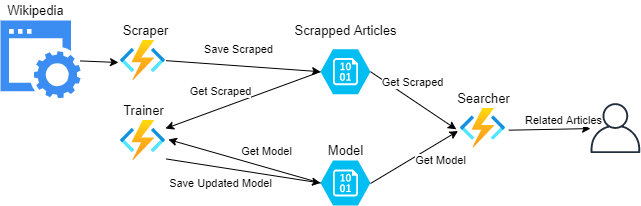

# Simgine

Simgine: Serverless real-time document similarity engine using Python and Azure Functions

## Functionalities

For an end user:
  - Given a keyword system will return a response with articles 
  which are semantically similar to it

Other functionalities not available to the end user:
  - Parsing data
  - Adding data to training set
  - Train saved model
  - Continuous monitoring of model's performance
  - Ability to use the model independently from system's Architecture

## Architecture

Initial Data flow

## Technology Stack

- Azure Ecosystem:
    - Blob Storage
    - Functions
- Python 3.9 
    - Scrapy
    - Nltk (Natural language toolkit)

## Wikipedia
Wikipedia's robots.txt doesn't disallow scraping of article pages

## Time table:

| Date |What|Description|time|
| --- |---|---|---|
| 29.11 |Data model| how the article will be simplified
| 3.12  |Scraper| processed data from wikipedia in compliance with it's policy
| 6.12  |Blob storage policy (Scrapped Articles)|how to store articles in blob storage
| 9.12  |Blob storage policy (Model)|how to store model in blob storage
| 17.12 |Trainer| function for model learning
| 14.01 |Searcher| end user accessible function

## Contributors

- Piotr Jeleniewicz
- Aleksei Haidukevich
- Patryk Piętka
